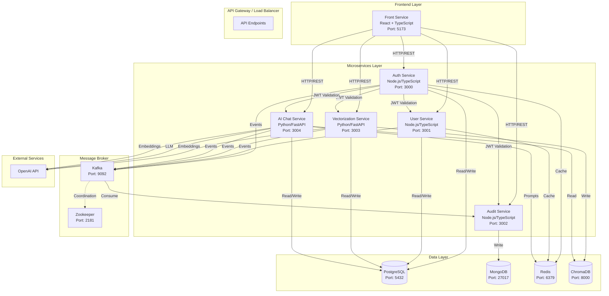
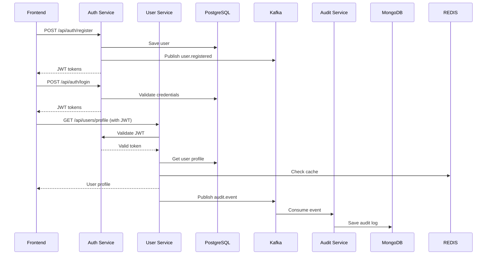
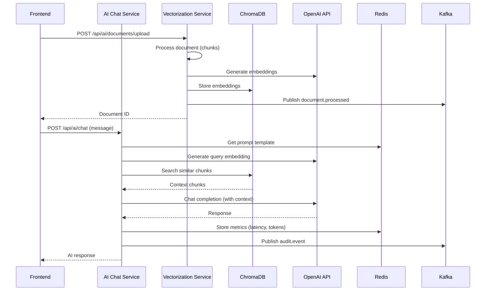

# Arquitectura del Sistema - Prueba Técnica

## Diagrama de Arquitectura General

El siguiente diagrama muestra la arquitectura completa del sistema de microservicios:



## Diagrama de Flujo de Datos - Autenticación y Usuario



## Diagrama de Flujo de Datos - RAG y Chat con IA



## Justificación Técnica de Decisiones

### Microservicios

**Decisión**: Implementar 5 microservicios independientes (auth-service, user-service, audit-service, vectorization-service, ai-chat-service)

**Justificación**:
- Separación de responsabilidades: cada servicio tiene un dominio específico
- Escalabilidad independiente: servicios con diferentes cargas pueden escalar por separado
- Tecnología heterogénea: permite usar Node.js para servicios transaccionales y Python para servicios de IA
- Despliegue independiente: cambios en un servicio no afectan a otros

### Comunicación entre Servicios

**REST (Síncrona)**:
- Uso: Consultas directas entre servicios, validación de JWT
- Justificación: Simplicidad, bajo overhead, adecuado para operaciones que requieren respuesta inmediata
- Ejemplo: Auth-service valida tokens para otros servicios

**Kafka (Asíncrona)**:
- Uso: Eventos de auditoría, eventos de dominio (user.registered, document.processed)
- Justificación: Desacoplamiento temporal, alta disponibilidad, procesamiento asíncrono de eventos
- Beneficios: Los servicios no se bloquean esperando procesamiento de auditoría

### Estrategia Multi-DB

**PostgreSQL**:
- Servicios: auth-service, user-service, vectorization-service, ai-chat-service
- Justificación: ACID, transacciones complejas, relaciones entre entidades, consistencia fuerte
- Uso: Datos transaccionales críticos (usuarios, autenticación, conversaciones)

**MongoDB**:
- Servicios: audit-service
- Justificación: Escritura intensiva, documentos flexibles, escalabilidad horizontal para logs
- Uso: Logs de auditoría que no requieren transacciones complejas

**Redis**:
- Uso: Caché, almacenamiento de prompts
- Justificación: Baja latencia, operaciones en memoria, TTL automático
- Beneficios: Reduce carga en bases de datos principales, mejora tiempos de respuesta

**ChromaDB**:
- Uso: Vector database para RAG
- Justificación: Optimizado para búsqueda por similitud, embeddings de alta dimensión
- Beneficios: Búsqueda semántica eficiente para contexto en respuestas de IA

### Autenticación Distribuida

**JWT (JSON Web Tokens)**:
- Decisión: Tokens firmados compartidos entre servicios
- Justificación: Stateless, escalable, no requiere base de datos compartida para validación
- Implementación: Cada servicio valida tokens usando el mismo secret (JWT_ACCESS_SECRET)
- Ventajas: No hay punto único de fallo, validación rápida

### Integración de IA

**Arquitectura RAG (Retrieval-Augmented Generation)**:
- Pipeline: Documentos → Chunks → Embeddings → ChromaDB → Búsqueda semántica → Contexto → LLM
- Justificación: Mejora precisión de respuestas, reduce alucinaciones, permite conocimiento específico del dominio
- Separación de servicios: vectorization-service procesa documentos, ai-chat-service genera respuestas

**OpenAI API**:
- Decisión: Usar OpenAI para embeddings y LLM
- Justificación: Alta calidad, modelos optimizados (gpt-4o-mini, text-embedding-3-small), fácil integración
- Alternativas consideradas: Modelos locales (mayor latencia, menor calidad), Azure OpenAI (similar, pero más complejo)

## Aplicación de DDD (Domain-Driven Design)

### Estructura de Capas

Cada microservicio sigue la estructura de Clean Architecture con capas bien definidas:

```
src/
├── domain/           # Capa de dominio (reglas de negocio)
│   ├── entities/    # Entidades de dominio
│   ├── value-objects/ # Objetos de valor
│   ├── repositories/ # Interfaces de repositorios
│   └── services/    # Servicios de dominio
├── application/      # Capa de aplicación (casos de uso)
│   ├── use-cases/   # Casos de uso
│   ├── dto/         # Data Transfer Objects
│   └── ports/       # Interfaces (puertos)
└── infrastructure/  # Capa de infraestructura (implementaciones)
    ├── persistence/ # Repositorios concretos
    ├── services/    # Servicios externos
    ├── messaging/   # Kafka, eventos
    └── config/      # Configuración
```

### Principios DDD Aplicados

**Entidades de Dominio**:
- User (auth-service): Encapsula lógica de autenticación y autorización
- UserProfile (user-service): Gestiona información de perfil de usuario
- AuditLog (audit-service): Representa eventos de auditoría inmutables
- DocumentChunk (vectorization-service): Representa fragmentos de documentos con embeddings

**Value Objects**:
- Email: Validación y normalización de emails
- Password: Encriptación y validación de contraseñas
- Action, EntityType: Tipos seguros para auditoría

**Servicios de Dominio**:
- AuthDomainService: Lógica de negocio de autenticación (activación, cambio de roles)
- UserDomainService: Reglas de negocio para perfiles de usuario

**Repositorios (Interfaces)**:
- IUserRepository, IAuditLogRepository: Abstracciones que permiten cambiar implementaciones
- Separación entre dominio (interfaces) e infraestructura (implementaciones concretas)

### Bounded Contexts

Cada microservicio representa un Bounded Context:
- **Auth Context**: Autenticación, autorización, gestión de usuarios del sistema
- **User Context**: Perfiles de usuario, información personal
- **Audit Context**: Registro de eventos y acciones del sistema
- **Vectorization Context**: Procesamiento de documentos y generación de embeddings
- **AI Chat Context**: Conversaciones con IA, RAG, gestión de prompts

## Aplicación de Clean Architecture

### Dependencias Invertidas

Las capas externas dependen de las internas, no al revés:

```
Infrastructure → Application → Domain
     ↓              ↓            ↑
  (implementa)  (usa)      (define)
```

**Ejemplo**:
- Domain define `IUserRepository` (interfaz)
- Infrastructure implementa `PostgresUserProfileRepository` (implementación)
- Application usa la interfaz, no la implementación concreta

### Inversión de Dependencias

Los casos de uso dependen de abstracciones (puertos), no de implementaciones:

```typescript
// Application Layer
class CreateUserProfileUseCase {
    constructor(
        private userDomainService: UserDomainService,  // Domain
        private cacheService: ICacheService,           // Port (interface)
        private eventPublisher: IEventPublisher        // Port (interface)
    ) {}
}
```

### Separación de Responsabilidades

- **Domain**: Reglas de negocio puras, sin dependencias externas
- **Application**: Orquesta casos de uso, coordina dominio e infraestructura
- **Infrastructure**: Implementa detalles técnicos (DB, Kafka, Redis, APIs externas)
- **Presentation**: Controladores, rutas, middlewares (solo en servicios Node.js)

## Flujos de Datos Principales

### 1. Flujo de Registro de Usuario

1. Frontend envía datos de registro a auth-service
2. auth-service valida y crea usuario en PostgreSQL
3. auth-service publica evento `user.registered` en Kafka
4. user-service consume evento y crea perfil inicial
5. audit-service consume evento y registra acción
6. auth-service retorna JWT al frontend

### 2. Flujo de Chat con IA (RAG)

1. Usuario sube documento → vectorization-service
2. Servicio procesa documento en chunks
3. Genera embeddings con OpenAI
4. Almacena en ChromaDB
5. Usuario envía mensaje → ai-chat-service
6. Servicio genera embedding de la consulta
7. Busca chunks similares en ChromaDB
8. Construye contexto con chunks relevantes
9. Envía a OpenAI con contexto
10. Retorna respuesta al usuario
11. Registra métricas (latencia, tokens) en Redis

### 3. Flujo de Auditoría

1. Cualquier servicio realiza acción importante
2. Publica evento `audit.event` en Kafka
3. audit-service consume evento asíncronamente
4. Valida y crea AuditLog
5. Persiste en MongoDB
6. No bloquea el servicio original

## Consideraciones de Seguridad

- **JWT**: Tokens firmados con secret compartido, expiración configurable
- **Validación de inputs**: Sanitización en todos los endpoints
- **Autenticación**: Middleware de autenticación en todos los servicios
- **Autorización**: Control de roles (ADMIN, USER) en operaciones sensibles
- **Variables de entorno**: Secrets no hardcodeados, uso de .env

## Escalabilidad

- **Horizontal**: Cada servicio puede escalarse independientemente
- **Caché**: Redis reduce carga en bases de datos
- **Message Broker**: Kafka permite procesamiento paralelo de eventos
- **Stateless**: Servicios sin estado permiten múltiples instancias
- **Base de datos**: MongoDB y PostgreSQL soportan réplicas y sharding

## Resiliencia

- **Healthchecks**: Todos los servicios tienen endpoints /health
- **Dependencias**: Docker Compose maneja dependencias entre servicios
- **Error handling**: Middleware de manejo de errores en cada servicio
- **Eventos asíncronos**: Kafka permite reintentos y procesamiento diferido
- **Graceful degradation**: Servicios pueden funcionar sin caché o eventos opcionales
