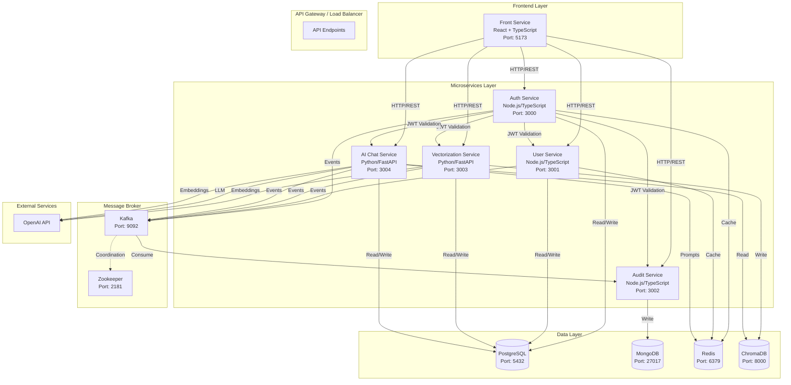
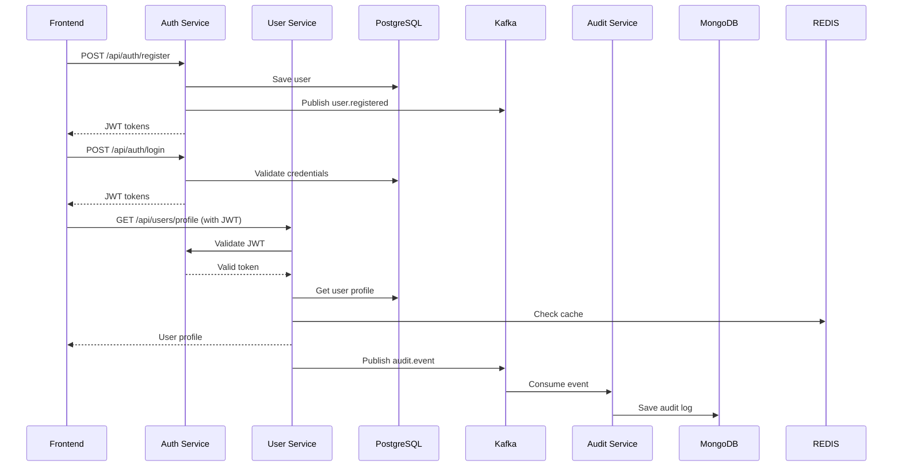
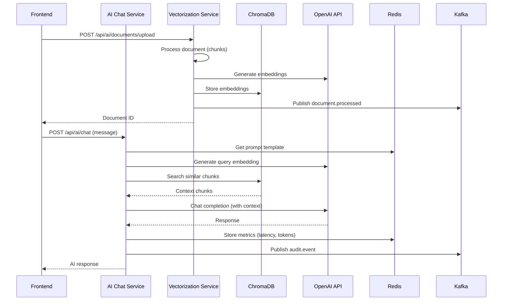

# Arquitectura del Sistema - Prueba Técnica

## Diagrama de Arquitectura General

El siguiente diagrama muestra la arquitectura completa del sistema de microservicios:

## Diagrama de Flujo de Datos - Autenticación y Usuario

## Diagrama de Flujo de Datos - RAG y Chat con IA

